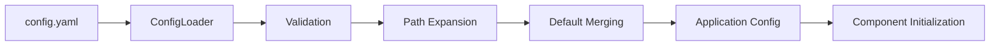

# SecureDownloadsOrchestrator 2.0 - Architecture Documentation

## 🏗️ System Architecture Overview

SecureDownloadsOrchestrator 2.0 is designed as a modular, extensible file processing system with a focus on security, maintainability, and future AI integration capabilities.

## 📐 High-Level Architecture


## 🧩 Core Components

### 1. Application Entry Point (`main.py` & `orchestrator/main.py`)

**Purpose**: Application orchestration and lifecycle management

**Key Responsibilities**:
- Configuration loading and validation
- Component initialization
- Error handling and graceful shutdown
- Main application loop management

**Design Patterns**:
- **Facade Pattern**: Simplifies complex subsystem interactions
- **Template Method**: Standardized application startup/shutdown sequence

```python
def main():
    config = load_config("config.yaml")
    logger = setup_logger("orchestrator", config)
    
    # Validation and setup phase
    validate_configuration(config, logger)
    create_directories(config, logger)
    
    # Main execution phase
    watcher = setup_file_watcher(config, logger)
    watcher.start()
    
    # Cleanup phase (exception handling)
    graceful_shutdown(watcher, logger)
```

### 2. Configuration Management (`config_loader.py`)

**Purpose**: Centralized configuration management with validation

**Key Features**:
- YAML-based configuration with defaults
- User path expansion (`~` support)
- Deep merging of configuration sections
- Comprehensive validation with error reporting

**Design Patterns**:
- **Strategy Pattern**: Pluggable configuration sources
- **Builder Pattern**: Incremental configuration construction

**Configuration Schema**:
```yaml
directories:          # Required: File path configuration
  source: string      # Source directory to monitor
  destination: string # Base destination for organized files

categories:           # Required: File classification rules
  [category_name]:
    extensions: list  # File extensions for this category
    destination: string # Subdirectory for this category

logging:              # Optional: Logging configuration
  console:
    enabled: boolean
    level: string
  file:
    enabled: boolean
    path: string
    level: string

application:          # Required: Application metadata
  name: string
  version: string
  startup:
    validate_config: boolean
    create_missing_dirs: boolean

processing:           # Optional: Advanced processing features
  enable_ai_classification: boolean
  enable_security_scan: boolean
```

### 3. Logging System (`logger.py`)

**Purpose**: Structured logging with multiple outputs and configurable levels

**Features**:
- Multi-handler logging (console + file)
- Configurable log levels per handler
- Automatic log directory creation
- Startup/shutdown event logging
- Structured log formatting

**Design Patterns**:
- **Factory Pattern**: Logger creation with configuration
- **Observer Pattern**: Multiple log handlers for different outputs

### 4. File System Monitoring (`file_watcher.py`)

**Purpose**: Real-time file system event detection and handling

**Technology**: Built on `watchdog` library for cross-platform compatibility

**Event Handling**:
- File creation events
- File modification events
- Automatic callback execution
- Error resilience with logging

**Design Patterns**:
- **Observer Pattern**: Event-driven file monitoring
- **Command Pattern**: Encapsulated file processing commands

```python
class FileWatcher:
    def __init__(self, watch_directory, callback, logger):
        self.observer = Observer()
        self.event_handler = NewFileHandler(callback, logger)
        
    def start(self):
        self.observer.schedule(self.event_handler, self.watch_directory, recursive=True)
        self.observer.start()
```

### 5. File Classification Engine (`classifier.py`)

**Purpose**: Multi-layer file type classification and categorization

**Classification Layers**:
1. **Extension-based Classification**: Fast initial categorization
2. **MIME Type Detection**: Magic number validation via `python-magic`
3. **Configurable Category Mapping**: User-defined classification rules

**Supported Categories**:
- Documents (PDF, Word, Text files)
- Images (JPEG, PNG, GIF, etc.)
- Audio (MP3, WAV, FLAC, etc.)
- Video (MP4, AVI, MKV, etc.)
- Archives (ZIP, RAR, 7Z, etc.)
- Code (Python, JavaScript, HTML, etc.)
- Executables (EXE, MSI, DMG, etc.)

**Design Patterns**:
- **Strategy Pattern**: Multiple classification algorithms
- **Chain of Responsibility**: Layered classification pipeline

```python
class FileClassifier:
    def classify_file(self, filepath: str) -> str:
        # Layer 1: Extension-based classification
        ext_category = self._classify_by_extension(filepath)
        
        # Layer 2: MIME type validation
        mime_category = self._classify_by_mime_type(filepath)
        
        # Layer 3: Resolve conflicts and return final classification
        return self._resolve_classification(ext_category, mime_category)
```

### 6. File Type Detection (`file_type_detector.py`)

**Purpose**: Low-level file type detection using magic numbers

**Features**:
- MIME type detection via libmagic
- File metadata extraction (size, timestamps)
- Error handling for corrupted or inaccessible files
- Cross-platform compatibility

**Integration**: Used by the Classification Engine for validation

## 🔧 Extensibility Framework

### Future AI Integration Points

The architecture is designed for seamless AI integration:

```python
# Current implementation
def handle_new_file(filepath, logger):
    file_category = classify_file(filepath, logger)
    # Process based on category

# Future AI-enhanced implementation  
def handle_new_file(filepath, logger):
    base_category = classify_file(filepath, logger)
    
    if config.processing.enable_ai_classification:
        ai_category = ai_classify_file(filepath)
        final_category = merge_classifications(base_category, ai_category)
    else:
        final_category = base_category
        
    # Enhanced processing with AI insights
```

### Security Scanning Framework

Modular security scanning system for future expansion:

```python
# Security scanning hook points
def process_file(filepath, category, logger):
    if config.processing.enable_security_scan:
        security_result = scan_file_security(filepath, category)
        if security_result.threat_detected:
            handle_security_threat(filepath, security_result)
            return
    
    # Normal file processing
    organize_file(filepath, category)
```

### Plugin Architecture (Future)

Planned plugin system for extensibility:

```python
# Plugin interface design
class FileProcessorPlugin:
    def can_handle(self, filepath: str, category: str) -> bool:
        """Return True if this plugin can process the file"""
        
    def process_file(self, filepath: str, metadata: dict) -> ProcessingResult:
        """Process the file and return results"""
        
# Plugin registration
plugin_manager.register_plugin(CustomProcessorPlugin())
```

## 🔒 Security Architecture

### Security Principles

1. **Least Privilege**: Minimal file system permissions required
2. **Input Validation**: All file paths and configuration inputs validated
3. **Safe Defaults**: Secure configuration defaults
4. **Error Containment**: Isolated error handling prevents cascading failures
5. **Audit Logging**: Comprehensive logging of all file operations

### Security Components

#### 1. Path Validation
```python
def validate_file_path(filepath: str) -> bool:
    """Validate file path for security concerns"""
    # Check for path traversal attempts
    if ".." in filepath or "~" in filepath:
        return False
    
    # Ensure path is within allowed directories
    if not is_within_allowed_paths(filepath):
        return False
        
    return True
```

#### 2. File Type Validation
```python
def validate_file_type(filepath: str) -> SecurityResult:
    """Validate file type for security concerns"""
    # Check file extension against blocklist
    # Validate MIME type consistency
    # Check for embedded executables
    # Scan for known malicious patterns
```

#### 3. Configuration Security
- Configuration files validated against schema
- No arbitrary code execution in configuration
- Secure defaults for all optional settings
- Input sanitization for all user-provided paths

### Security Scanning Integration

Framework for future security scanner integration:

```python
class SecurityScanner:
    def scan_file(self, filepath: str) -> ScanResult:
        """Scan file for security threats"""
        
    def get_threat_level(self, scan_result: ScanResult) -> ThreatLevel:
        """Assess threat level from scan results"""

# Integration points
security_scanners = [
    VirusScannerPlugin(),
    MalwareDetectionPlugin(),
    DocumentAnalyzerPlugin(),
]
```

## 🔄 Workflow Automation Architecture

### CI/CD Pipeline Design

The GitHub Actions workflows implement a comprehensive automation strategy:

#### 1. Continuous Integration (`ci.yml`)
```yaml
# Workflow stages:
1. Environment Setup
   - Python environment configuration
   - Dependency installation
   - Cache management

2. Code Quality Assurance  
   - Linting (flake8)
   - Formatting (black)
   - Type checking (mypy)
   - Import sorting (isort)

3. Security Scanning
   - Dependency vulnerability scanning (safety)
   - Code security analysis (bandit)
   - Static analysis integration

4. Testing
   - Unit tests with pytest
   - Integration tests
   - Coverage reporting
   - Test result artifacts

5. Build & Package
   - Application packaging
   - Artifact generation
   - Build verification
```

#### 2. Security Automation (`codeql.yml`)
- Automated vulnerability detection
- Language-specific analysis (Python)
- Integration with GitHub Security Dashboard
- Scheduled and event-triggered scans

#### 3. Deployment Pipeline (`deploy.yml`)
```yaml
# Deployment stages:
1. Pre-deployment Validation
   - Configuration validation
   - Environment health checks
   - Dependency verification

2. Deployment Execution
   - Environment-specific deployments
   - Configuration management
   - Service startup verification

3. Post-deployment Testing
   - Smoke tests
   - Health monitoring
   - Rollback capabilities
```

### Self-Hosted Runner Architecture

Optimized for self-hosted GitHub Actions runners:

- **Resource Management**: Efficient resource utilization
- **Security Isolation**: Secure execution environment
- **Artifact Management**: Optimized artifact storage and retrieval
- **Monitoring**: Comprehensive runner health monitoring

## 📊 Data Flow Architecture

### File Processing Pipeline


### Configuration Flow



## 🧪 Testing Architecture

### Testing Strategy

1. **Unit Tests**: Individual component testing with mocks
2. **Integration Tests**: Component interaction testing
3. **End-to-End Tests**: Complete workflow validation
4. **Performance Tests**: Resource usage and scalability
5. **Security Tests**: Vulnerability and penetration testing

### Test Structure
```
tests/
├── unit/
│   ├── test_config_loader.py
│   ├── test_classifier.py
│   ├── test_file_detector.py
│   └── test_logger.py
├── integration/
│   ├── test_file_processing_pipeline.py
│   └── test_configuration_integration.py
├── e2e/
│   └── test_complete_workflow.py
├── performance/
│   └── test_large_file_handling.py
└── security/
    └── test_path_traversal_protection.py
```

## 🔮 Future Architecture Enhancements

### Planned Improvements

1. **Microservices Architecture**: Component separation for scalability
2. **Event Sourcing**: Complete audit trail of all file operations
3. **Database Integration**: Metadata storage and querying capabilities
4. **API Layer**: RESTful API for external integrations
5. **Web Interface**: Browser-based configuration and monitoring
6. **Machine Learning Pipeline**: AI-powered file classification and insights

### Scalability Considerations

- **Horizontal Scaling**: Multi-instance deployment support
- **Load Balancing**: Request distribution across instances
- **Caching Strategy**: Metadata and classification result caching
- **Database Sharding**: Large-scale metadata storage
- **Message Queues**: Asynchronous file processing

### Technology Evolution Path


---

This architecture documentation provides a comprehensive overview of the SecureDownloadsOrchestrator 2.0 system design, focusing on modularity, extensibility, and security best practices. The architecture supports current functionality while providing clear paths for future enhancements and AI integration.